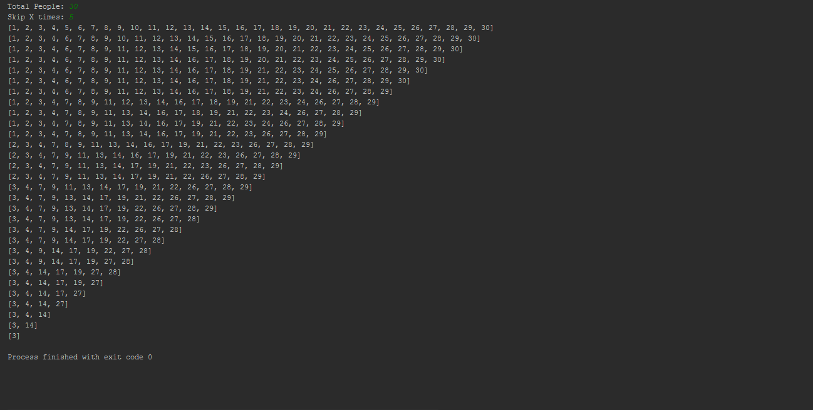

# Josephus Problem

Josephus Problem - 2018 (Java)

N people are standing in a circle waiting to be executed. The counting begins at specified point in the circle and proceeds around the circle in a specified direction. After a specified number of people are skipped, the next person is executed. The procedure is repeated with the remaining people, starting with the next person, going in the same direction and skipping the same number of people, until only one person remains.

Josephus Problem doesn't require installation but does need to pre-installed Java.

<a href="https://github.com/onursert/JosephusProblem/raw/master/JosephusProblem.java">Download Josephus Problem</a>
